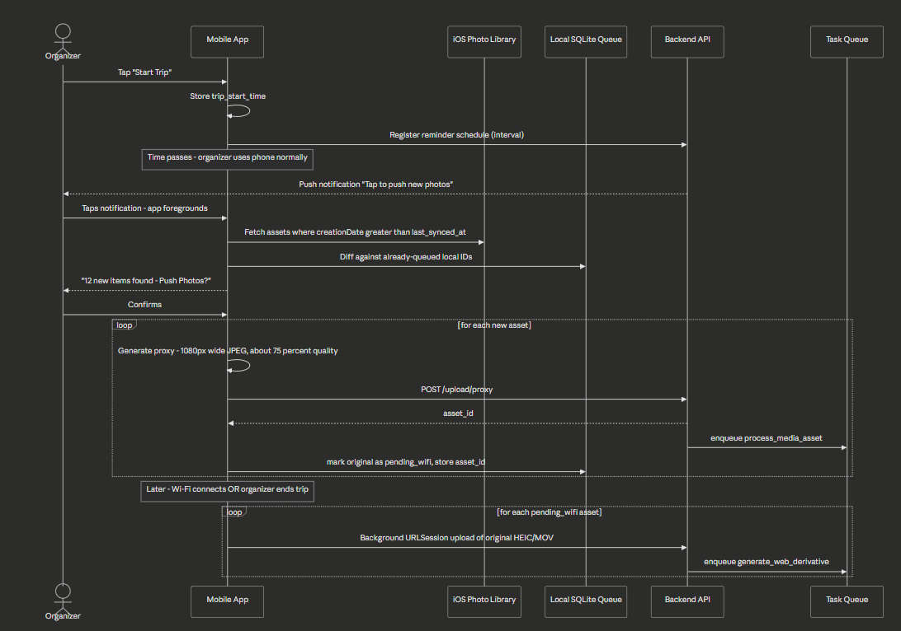
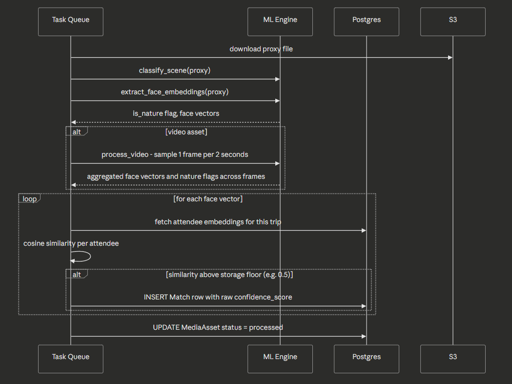
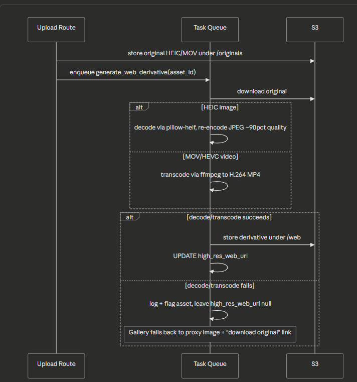
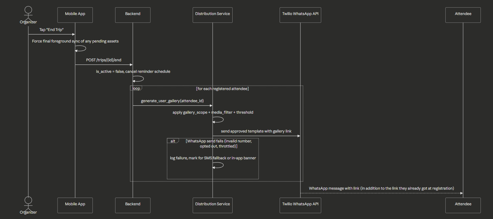
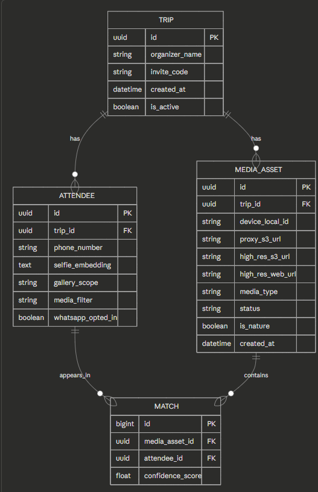
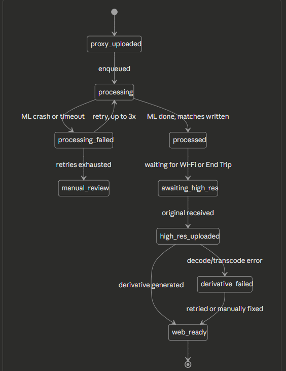

# Trip Photo-Sharing App — Detailed Architecture Plan

**Target platform:** iPhone (organizer + photo-taking attendees) · Guest registration/gallery via any browser
**Core idea:** Trip-scoped photo collection → face-matched personal galleries → WhatsApp delivery

This plan incorporates every constraint discussed earlier (iOS background limits, HEIC/browser compatibility, WhatsApp template policy, biometric data handling) and bakes in fallback solutions for each failure point.

---

## 1. Design Principles

1. **Nothing silent.** Every upload action is either user-confirmed (tap-to-push) or happens transparently in a system-visible way (background `URLSession` transfer). This keeps you compliant with App Store review and avoids surprising users.
2. **Three-tier media pipeline.** Proxy (instant, cheap, for matching) → Original (Wi-Fi, archival quality) → Web derivative (cross-browser display). Never serve raw HEIC to a generic browser.
3. **Everything is retry-able.** Every step writes a status to durable storage (local SQLite or Postgres) before moving on, so a crash/kill/connectivity loss never loses data — it just resumes from the last known state.
4. **Decouple matching threshold from match storage.** Store match scores generously; apply the strict cutoff at gallery-generation time so you can retune without reprocessing.
5. **Graceful degradation everywhere.** If a "smart" feature fails (face match, scene classification, derivative generation), the user still gets *something* (e.g., the full unsorted gallery, or the original file with no preview) rather than a dead end.

---

## 2. High-Level Architecture

## 3. Component Breakdown

| Layer | Component | Responsibility |
|---|---|---|
| Mobile | Trip Manager | Tracks `trip_start_time`, active/ended state, sync settings |
| Mobile | Notification Scheduler | Server-driven push reminder every N hours; local fallback trigger |
| Mobile | Delta Photo Scanner | On foreground/tap, diffs `PHAsset` library against locally-tracked uploaded IDs |
| Mobile | Local SQLite Queue | Source of truth for per-asset upload state (idempotent, survives app kill) |
| Mobile | Upload Manager | Generates proxy, uploads via standard request; queues original for `URLSession` background transfer |
| Backend | Trip/Registration Routes | Trip creation, QR generation, attendee selfie registration |
| Backend | Upload Routes | Receives proxy + original files, writes S3 + DB rows |
| Backend | Task Queue | Celery (or RQ/SQS) — replaces in-process `BackgroundTasks` for durability and horizontal scaling |
| Backend | ML Engine | Face embedding extraction, scene classification, video frame sampling |
| Backend | Distribution Service | Builds personal galleries, sends WhatsApp template notifications |
| Infra | S3 | Three prefixes: `/proxies`, `/originals`, `/web` |
| Infra | Postgres | Relational store, also candidate for `pgvector` if embedding search grows beyond simple cosine loops |
| Infra | CDN (CloudFront or similar) | Fronts `/web` derivatives so gallery load doesn't hit your backend directly |

---

## 4. End-to-End Flows

### 4.1 Attendee Registration (QR → Selfie → Preferences)

**Built-in fallback:** the personal gallery link is shown on-screen the moment registration succeeds — *before* any WhatsApp message is even attempted. WhatsApp becomes a convenience notification layered on top, not a single point of failure.

### 4.2 Capture → Reminder → Two-Tier Upload

**Why this is the realistic fix to "silent background upload":** every upload step is initiated either by an explicit tap (proxy batch) or by a background `URLSession` transfer that the OS itself manages and can complete even if the app is suspended afterward — both are within iOS's actual rules, unlike a fully autonomous background watcher.

### 4.3 Background ML Processing & Matching

### 4.4 High-Res Arrival → Web Derivative Generation

### 4.5 End of Trip → Gallery & WhatsApp Delivery

## 5. Data Model

### Refinements vs. the original spec

| Change | Reason |
|---|---|
| Split `gallery_preference` into `gallery_scope` (`mine_only` / `mine_and_nature` / `all`) and `media_filter` (`photos_only` / `videos_only` / `both`) | Avoids enum combinatorial explosion as you add more options later — two small dropdowns instead of N hardcoded strings |
| Added `high_res_web_url` to `MediaAsset` | Needed so the gallery can serve a browser-safe derivative while `high_res_s3_url` stays the pristine archival download |
| Replaced a single `is_processed` boolean with a `status` string/enum | One boolean can't represent "failed," "awaiting high-res," "derivative failed," etc. — see state diagram below |
| Added `device_local_id` with a unique constraint on `(trip_id, device_local_id)` | Idempotency key (the `PHAsset.localIdentifier`) — prevents duplicate `MediaAsset` rows if the user taps "Push Photos" twice or a retry double-fires |
| Added `whatsapp_opted_in` to `Attendee` | You need a recorded opt-in per messaging category to stay compliant with WhatsApp's policy |

---

## 6. MediaAsset State Machine

## 7. Fallback & Resilience Matrix

| Risk / Failure | Why it happens | Recommended fallback |
|---|---|---|
| iOS won't run silent background uploads | OS-level restriction, not a bug | Notification-triggered foreground sync (Section 4.2) — already the agreed design |
| User denies notification permission | Privacy choice | Persistent in-app "Push Photos" button shown every time the app opens, no dependency on notifications |
| Limited Photo Library access (iOS 14+) | User chose "Select Photos" instead of "All Photos" | Detect limited-access state via `PHPhotoLibrary.authorizationStatus`; show a "Select More Photos" prompt instead of silently scanning nothing |
| Network drops mid-upload | Normal mobile connectivity | Background `URLSession` for originals (OS resumes automatically); simple retry-with-backoff for proxies, tracked in local SQLite |
| App force-quit mid-queue | User swipes app away | Local SQLite queue persists regardless of process state; resumes next time the app opens or a reminder fires |
| Selfie has no detectable face | Bad lighting, angle, blurry photo | Reject with a friendly retry prompt at registration; never silently store a null/empty embedding |
| Selfie has multiple faces | User photographs a friend instead of themselves | Reject and ask for a solo photo |
| Low-confidence face match | Lighting/angle differences, embedding model limits | Store all matches above a low floor (~0.5), apply the stricter cutoff (~0.65, tuned empirically) only at gallery-generation time |
| ML worker crashes mid-job | OOM, malformed image, model error | Task queue with automatic retry (e.g. 3x with backoff) + dead-letter queue → `manual_review` status, with alerting if the queue backs up |
| HEIC fails to decode server-side | Corrupt file, unsupported variant | Catch and flag `derivative_failed`; gallery still shows the (already-uploaded) proxy image plus a "download original" link — never a dead page |
| Guest's browser can't render HEIC | Chrome/Firefox/Edge/Android never added native HEIC support | Always serve the generated JPEG/WebP `high_res_web_url` in the gallery ``, keep raw HEIC only as an optional "download original quality" link |
| WhatsApp template rejected or send fails | Bad number, opt-out, throttling, template misuse | Gallery link was already shown at registration (Section 4.1) — WhatsApp is a convenience layer, not the only delivery path; log failures for an SMS fallback if you want one later |
| Attendee never registers | Forgot to scan QR, no smartphone | Organizer can still share a trip-wide "everyone" gallery link manually; their photos still exist in the proxy/original pipeline either way |
| Bystander appears in a photo but never registered | Inherent to group photos at events | Don't persist long-term embeddings for unmatched faces — only registered attendees' embeddings are stored; bystander face vectors used transiently for matching, then discarded |
| Duplicate upload (user taps "Push" twice) | UI double-tap, retry race | Unique constraint on `(trip_id, device_local_id)` makes the insert idempotent — second attempt is a no-op |
| Sudden burst of uploads (many guests, same time) | Wedding/event traffic spikes | Task queue decoupled from the API process — backend stays responsive even if ML workers are temporarily behind |
| Asset deleted from device before upload completes | User cleans up storage mid-trip | Catch `PHAsset` fetch errors per-item, skip and log; don't crash the whole batch |

---

## 8. iOS-Specific Notes (Recap)

- **Reminder scheduling:** use a single repeating `UNTimeIntervalNotificationTrigger` (or server-driven APNs on a schedule) rather than one-off notifications per interval — avoids the 64-pending-notification cap entirely.
- **Original file transfer:** use a background `URLSession` configuration so large HEIC/MOV uploads can complete even after the app is suspended.
- **Always show the user what's happening** — "12 new items found," upload progress, completion state — both for App Store review compliance and basic trust.

---

## 9. WhatsApp Delivery & Compliance Notes

- Treat the registration form's phone number + explicit checkbox as your opt-in record for the "gallery delivery" message category — store it (`whatsapp_opted_in`).
- Pre-create and get Meta approval for a small, fixed set of templates (e.g., "Your trip photos are ready: {{link}}") *before* launch — template approval isn't instant.
- Use Twilio (or another Meta-approved BSP) rather than talking to the Cloud API directly, to simplify business verification.
- Never rely on WhatsApp as the *only* delivery path — see the registration flow's immediate on-screen link.

---

## 10. Privacy & Biometric Data Notes (not legal advice)

- Only persist embeddings for attendees who explicitly registered with a selfie; bystanders' face vectors are used transiently during matching and discarded afterward.
- Provide a deletion path: an attendee should be able to request removal of their embedding and matches.
- Define a retention window for the trip's data after it ends (e.g., embeddings purged N days post-trip, media retained longer if the organizer wants it).
- Given biometric-data laws vary significantly by region (GDPR, BIPA, and a growing list of US state rules), have a lawyer review the consent flow and retention policy before public launch.

---

## 11. Scaling & Infrastructure Notes

- Replace in-process `FastAPI BackgroundTasks` with a real task queue (Celery + Redis, or SQS + Lambda/worker fleet) — required once you have concurrent trips/events.
- Put a CDN in front of `/web` derivatives so repeated gallery views don't load your backend or origin S3 directly.
- Consider `pgvector` if embedding similarity search grows beyond simple per-trip loops (most trips will have few enough attendees that a plain loop is fine).

---

## 12. Tech Stack Summary

| Layer | Choice |
|---|---|
| Mobile | React Native, `expo-media-library`, `expo-file-system`, local SQLite, background `URLSession` |
| Backend API | FastAPI, SQLAlchemy, PostgreSQL |
| Task Queue | Celery + Redis (or SQS + worker pool) |
| ML | insightface (`buffalo_l`), lightweight CNN for scene classification, OpenCV/ffmpeg for video |
| Image handling | `pillow-heif`/`libheif` for HEIC decode, ffmpeg for HEVC video transcode |
| Storage | S3 (`/proxies`, `/originals`, `/web`) |
| Notifications | APNs (server-driven) + local `UNUserNotificationCenter` fallback |
| Messaging | Twilio WhatsApp Business API (template-based) |
| CDN | CloudFront (or equivalent) in front of `/web` |
